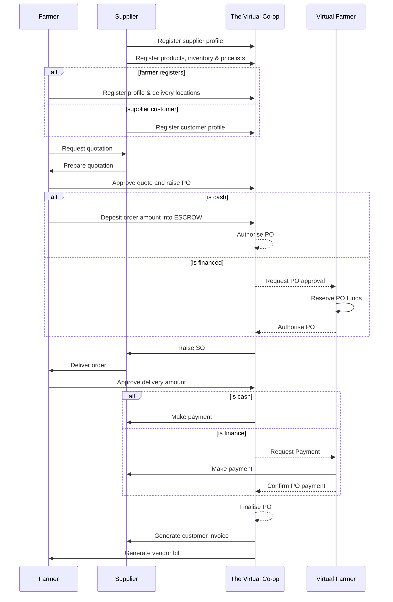

# The Virtual Co-op High-Level Process

```mermaid
sequenceDiagram
	participant F as Farmer
	participant S as Supplier
  participant VC as The Virtual Co-op
	participant VF as Virtual Farmer
  S->>VC: Register supplier profile
  S->>VC: Register products, inventory & pricelists
  alt farmer registers
	  F->>VC: Register profile & delivery locations
	else supplier customer
		S->>VC: Register customer profile
	end
  F->>S: Request quotation
	S->>F: Prepare quotation
	F->>VC: Approve quote and raise PO
  alt is cash
  	F->>VC: Deposit order amount into ESCROW
  	VC-->>VC: Authorise PO
	else is financed
		VC-->>VF: Request PO approval
  	VF->>VF: Reserve PO funds
  	VF-->>VC: Authorise PO
	end
	VC->>S: Raise SO
	S->>F: Deliver order
  F->>VC: Approve delivery amount
	alt is cash
		VC->>S: Make payment
  else is finance
    VC-->>VF: Request Payment
    VF->>S: Make payment
    VF-->>VC: Confirm PO payment
  end
	VC-->>VC: Finalise PO
	VC->>S: Generate customer invoice
	VC->>F: Generate vendor bill
```

