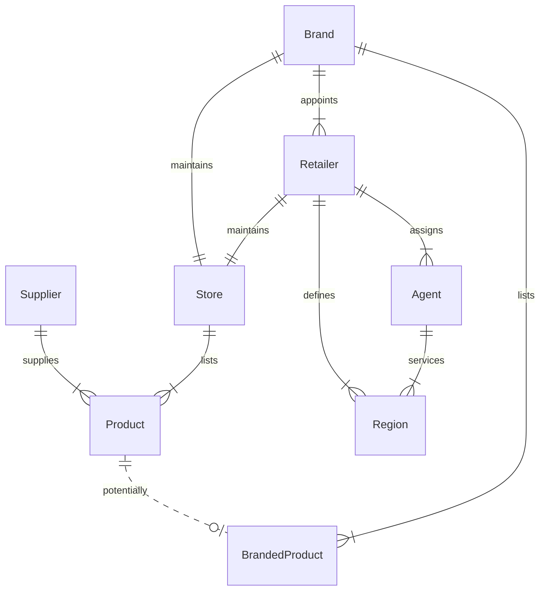
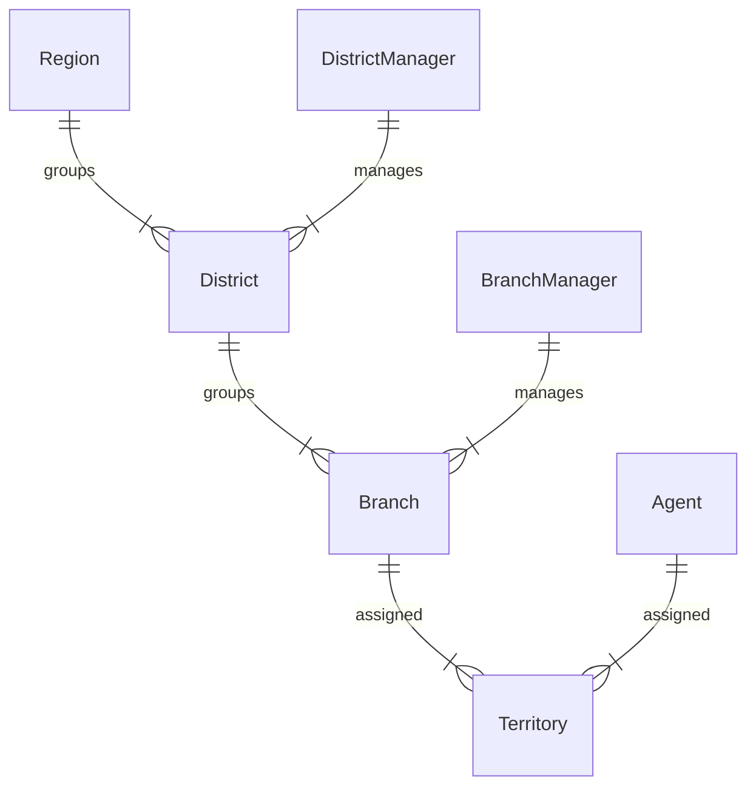

# The Virtual Co-op Conceptual Design

## Product Listings

```mermaid
erDiagram
    Supplier ||--|{ Product : supplies
    Product ||..o| BrandedProduct : potentially
    Brand ||--|{ BrandedProduct : lists
    Brand ||--|{ Retailer : appoints
    Brand ||--|| Store : maintains
    Retailer ||--|{ Agent : assigns
    Retailer ||--|| Store : maintains
    Retailer ||--|{ Region : defines
    Agent ||--|{ Region : services
    Store ||--|{ Product : lists
```

## Territories

```mermaid
erDiagram
    District ||--|{ Branch : groups
    BranchManager ||--|{ Branch : manages
    Region ||--|{ District : groups
    DistrictManager ||--|{ District : manages
    Branch ||--|{ Territory : assigned
    Agent ||--|{ Territory : assigned
```

## Procurement

Still to consider blanket orders and tenders.
