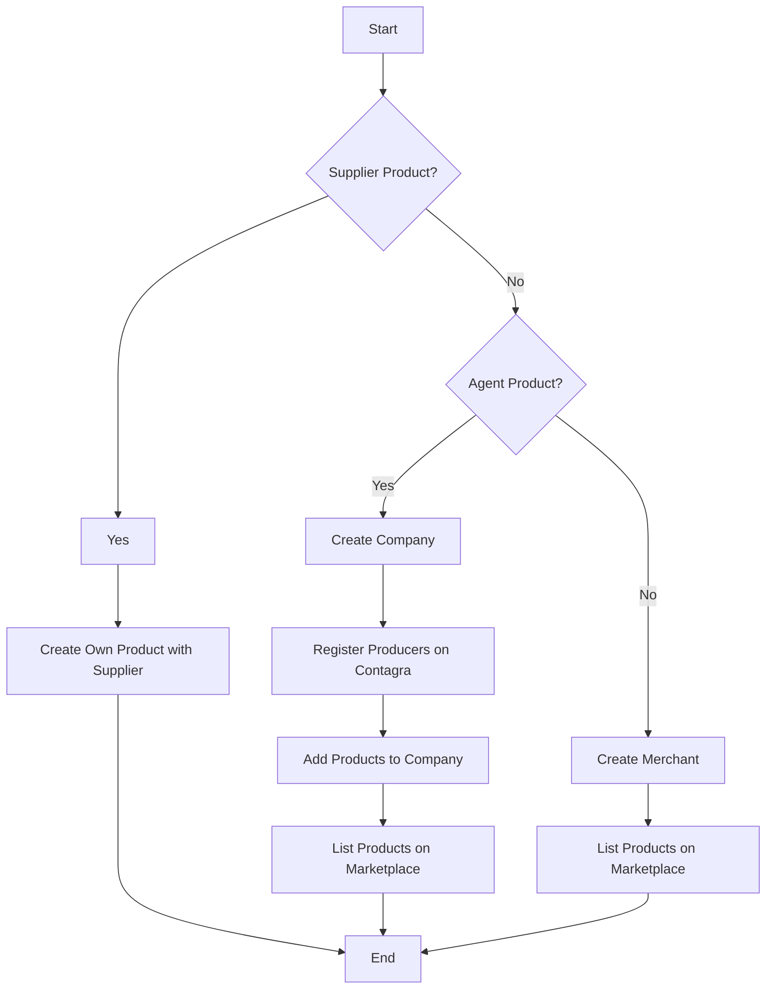

# Onboarding Workflow

```mermaid
flowchart TD
    A[Start] --> B{Supplier Product?}
    B --> Yes --> C[Create Own Product with Supplier]
    C ----> E[End]
    B -- No --> D{Agent Product?}
    D -- Yes --> F[Create Company]
    F --> G[Register Producers on Contagra]
    G --> I[Add Products to Company]
    I --> J[List Products on Marketplace]
    J --> E[End]
    D -- No --> K[Create Merchant]
    K --> L[List Products on Marketplace]
    L --> E[End]
```